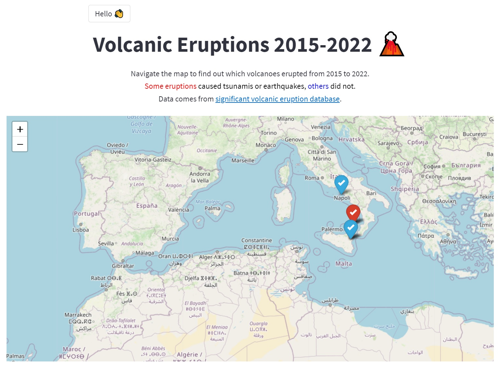
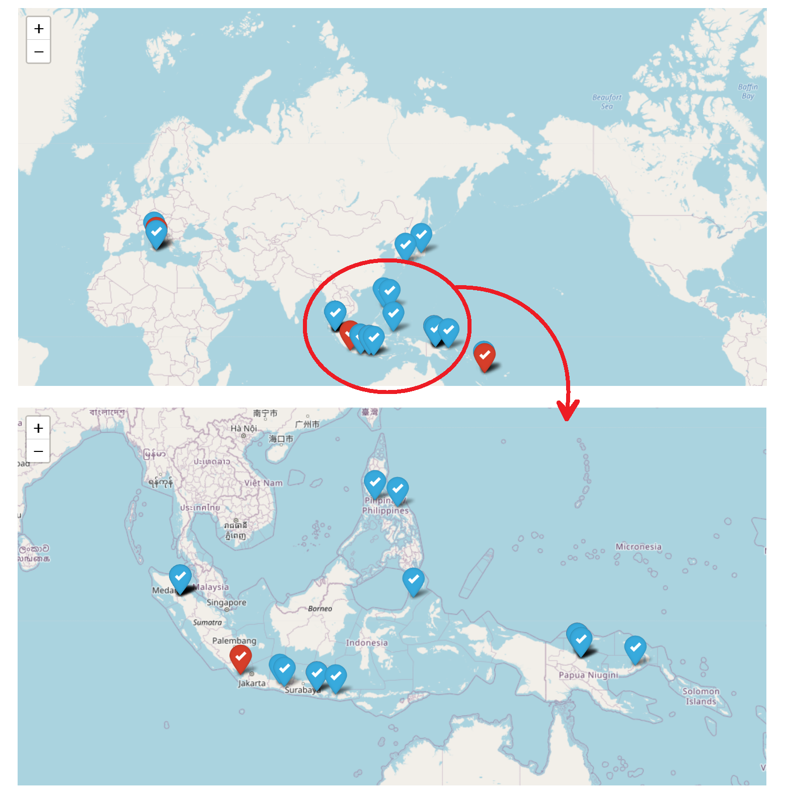
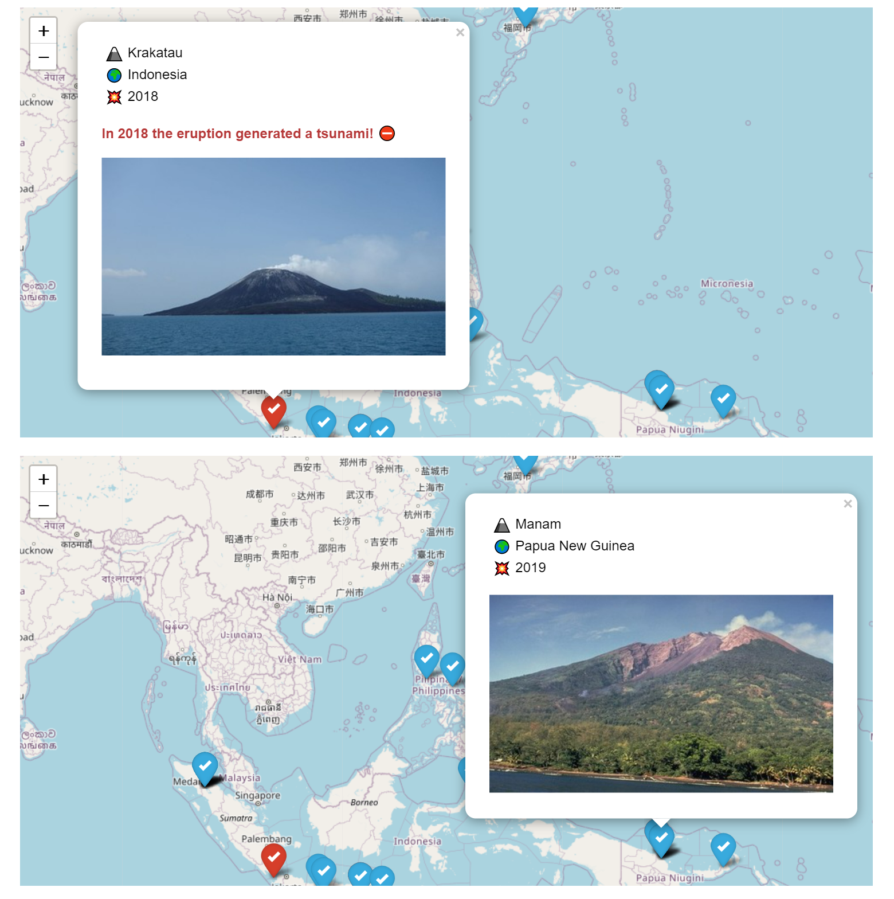

# 🌋 Volcanic Eruptions - Visualization WebApp Project
## 👉 **Check it out [here](https://share.streamlit.io/paulinomoskwa/volcanic-eruptions/main.py)!**

    

## 📖 **About**
This project comes up with the goal of testing several **interactive map** features. The website relies on two core libraries:

* `streamlit` for deploying a webapp into production
* `folium` for managing an interactive map

From the starting [data](https://public.opendatasoft.com/explore/dataset/significant-volcanic-eruption-database/information/?location=2,3.18934,-2.23&basemap=jawg.light), I created a dataset of volcano images and information on recent eruptions (2015 through 2022). Each row of information in the dataset includes: 

* the date of an eruption
* the name of the volcano that erupted
* the geographical location of the volcano (country and coordinates)
* consequences of the eruption (in terms of earthquake and tsunami)

By opening the website, it is possible to navigate the map (move around, zoom-in, zoom-out) and click on different marked places.

    

Volcanoes whose eruptions caused an earthquake or tsunami (or both) are marked in red. By clicking on the icon, a popup is displayed with a picture of the volcano and information about the eruption.

    

